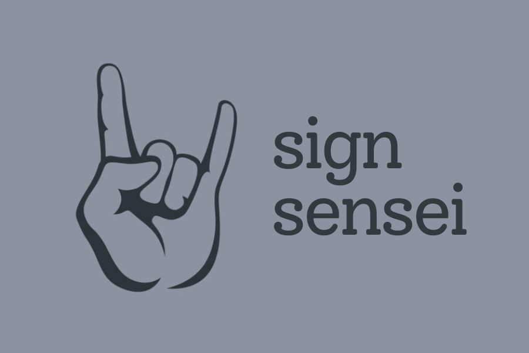

**_Learn sign language interactively with the help of AI._**

## Inspiration

In an increasingly interconnected world, one of the most important skills we can acquire is the ability to communicate effectively with people from diverse backgrounds and abilities. American Sign Language (ASL) is a language used by millions of deaf and hard-of-hearing individuals around the world. However, there are still significant barriers preventing many from learning and using ASL. Our project, SignSensei, aims to break down those barriers, making it easier and faster for anyone to learn ASL, as well as other sign languages. We hope to promote inclusivity through communication for all.

## What it does

SignSensei is a web application that gamifies the process of learning sign language. Using the webcam on your laptop (or front-facing camera on your phone), our app can detect the sign you are putting up with your hand, and tell you whether it is correct. You will be able to see yourself on the screen, as well as a lattice representation of your hand. This makes it easy to monitor your hands to make sure you are getting the signs right. The demo lesson (see video) teaches you the ASL alphabet. 

https://github.com/R1tzG/SignSensei/assets/86858242/40b4d428-f614-4800-8151-0d3d9c74f5af

## How we built it

Our sign language detection system is built in two parts. First we collect hand landmark coordinates using the Mediapipe machine learning library. We then pass the extracted coordinates through a custom fully connected neural network that we trained on a dataset of ASL signs. This approach allows us to detect signs from the webcam feed with high precision and accuracy (97% test accuracy on the custom model).
The sign detection system outlined above forms the backbone of our app. We also developed an interactive front-end with Streamlit, which serves lessons to users.

## Challenges we ran into

We were significantly challenged with developing an accurate detection model. Our first few attempts fell short in accuracy. We were eventually able to train a fast and accurate model for the task. Our final model is very simple but performant, made up primarily of Dense layers. 
Another challenge we ran into was developing the user interface. At first, we looked at using React, but found it difficult to integrate Tensorflow and OpenCV seamlessly. We decided to switch gears and develop our front-end with Streamlit, leveraging the power of the Python programming language. 

## Accomplishments that we're proud of

We are very proud of the powerful sign detection algorithm that we developed. Along with the use case that we found for ASL, the algorithm can easily be expanded to other sign languages, as well as applications in gesture recognition and VR gaming.

## What we learned

Through this project, we learned how to use Tensorflow to train machine learning models, as well as how they can be implemented in Javascript (even if this part didn't make it into the final application). We also learnt about different ways to make a front-end, from vanilla JS and React to solutions such as Flask.

## What's next for SignSensei

We're not done yet! We plan to add more interactive lessons to the app as well as add support for more sign languages. 

View our slideshow [here](https://www.canva.com/design/DAFuAQrskMQ/y0TeL7Q-odr6c6klXBmfXA/view?utm_content=DAFuAQrskMQ&utm_campaign=designshare&utm_medium=link&utm_source=publishsharelink)
